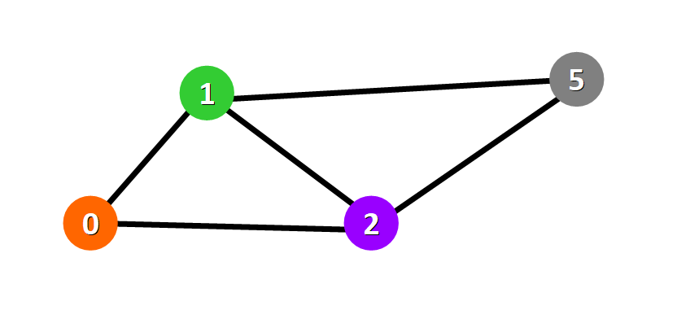
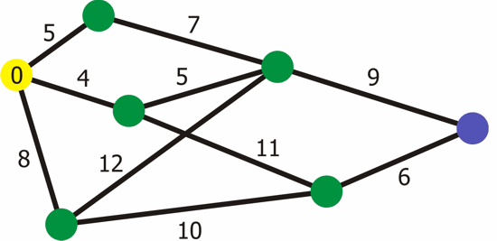

# EX1
oop university course assingment -weighted directional graph

**authors:**  
Elia Swisa & Elior Gueta

**summery:**

the project focused on pokemon game-agent who needs to catch the pokemons after they popped up on the edges of the graph in the shortest time as can. 
that graph built on data stracture of weighted directional graph. that project has several classes.

NodeData-who represents node in a graph as inner class of WGraph who has a field of adjacency list in a form of hashMap of nodes and keys 

EdgeData-represents the edges bewtween the nodes including source,destination and weight fields.

DWGraph_DS-who represents graph that build from NodeData and EdgeData HashMaps.

DWGraph_Algo-who represents algorithm and save and load methods that can save and load graphs from specific files DWGraph_DS class

GeoLocation-describe an geographic location on the graph (basicly an 3d point).

EdgeLocation-this class represents a position on the graph

EX2-This interface represents the main functionality of the game including all the methods that sends and recives data from the graph and communicates with the server

DW_JsonGraphDeserial-Abstract class that defines API used by ObjectMapper (and other chained JsonDeserializers too) to deserialize Objects of arbitrary types from JSON, using provided JsonParser.

***NodeData class methods:***

getKey-returns key

getInfo-gets info

setInfo-sets info

getTag-gets tag

setTag-sest tag

compareTo-comparing between two nodes

ToString-allow to print Node object

setWeight-setting weight  to the node

getWeight-gets weight from the node

getLocation-gets 3d location point

setLocation-sets 3d location point

*constructors getters and setters defined as well according to need*

***EdgeData class methods***

*constructors*

**getsrc**-getts the source  field

**getDest** -gets the destination field

**getWeight**- gets the weight field

**getInfo**-gets info from the edge as String

**setInfo**-sets the info

**getTag**-gets the tag

**setTag**-sets the tag
.

***DWGraph_DS class methods:***

**constructors**

**getNode** -gets node if contained in our graph

**getEdge** -gets Edge if existing in our graph

**addNode**-adds given node and her key to the graph hashMap 

**connect**-connects edges between two given nodes in the graph

**getV**-returns a view of collection of the nodes of the graph

**getE** -returns a pointer of collection of all the edges in the graph

**removeNode**-removing the node by his key and deleting this node from all  his neighbours adjacency list(detacheing the edges)

**removeEdge**-deleting the edges between two given nodes if they are neighbours in the graph

**nodeSize**-return the number of the nodes at the graph

**edgeSize**-return the number of the edges at the graph

**get mc**-return mode count of the graph
 

***WGraph_Algo class methods:***

       

**init**-initiates the graph algo graph

**copy**-returns graph with deep copy of the graph in the DWGraph_DS class

**shortestPathDist**- algorithm that finds the shortest path from source distance to destination distance

**shortestPath**-returnes alist of the nodes that traveled when we used the ShortestPathDist method

**getGraph-** returns the graph 

**isConnected**-algorithm that check if the graph is connected by connected graph definition

**save**-saves the graph to file by streaming all his data after implementing serilizable and google Gson

**load**-loads the graph from file by streaming all his data after implementing serilizable

**djikstra** -an side function based on djikstra algorithm that knows how to finds the shortest path using djikstra principle

visual simulation below:

***GeoLocation class methods*** 

**distance**- calculating the distance between two 3d points 

***EX2 class methods***-

